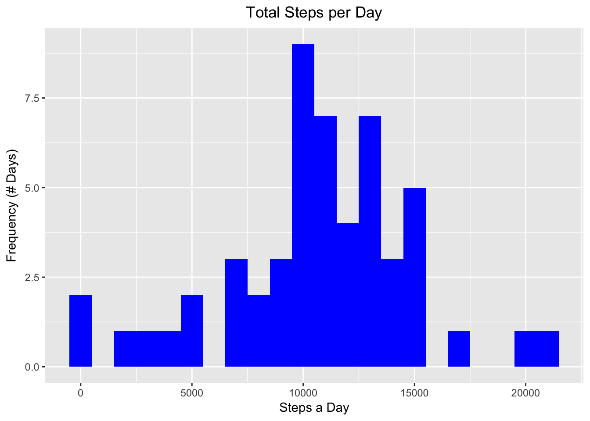
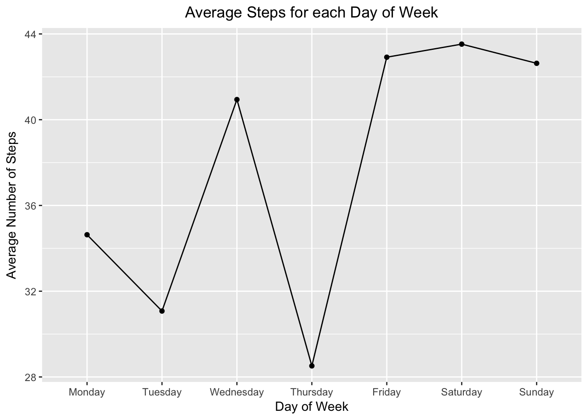
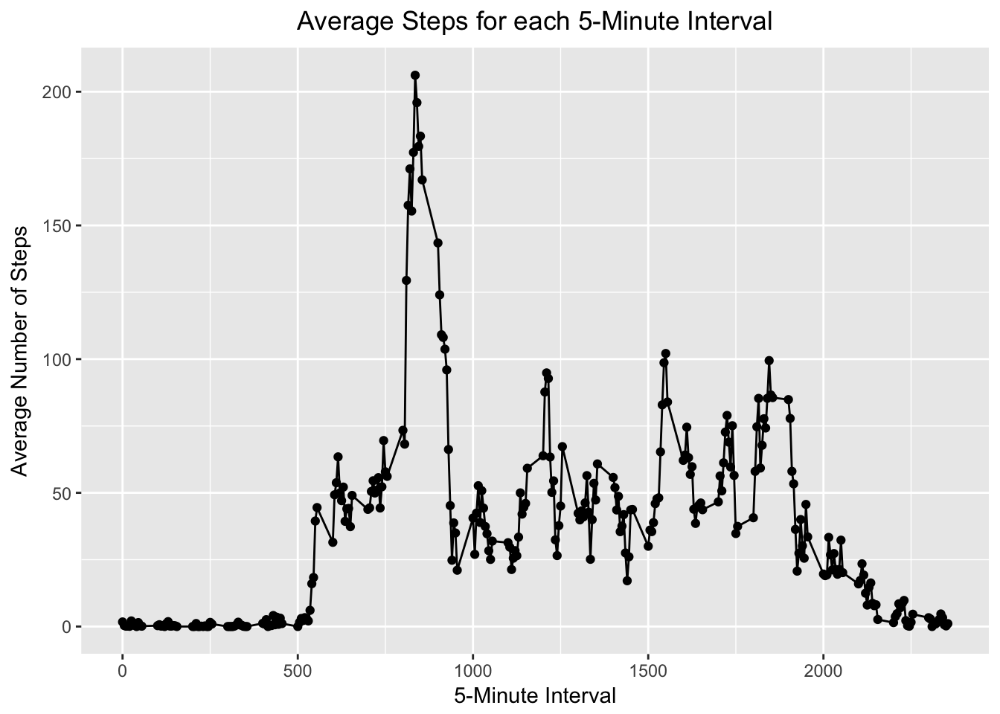
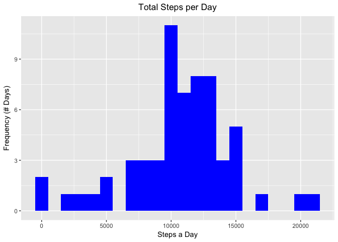
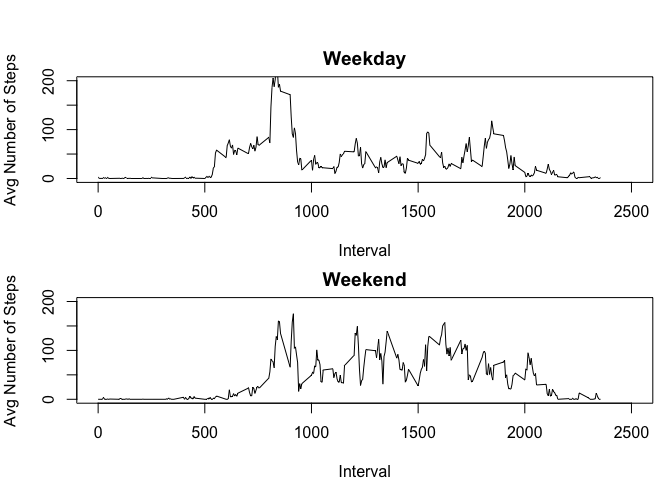

# First_Knitr
EHarris  
6/01/2017  

## Load anticipated packages to be used throughout Course 5 Project 1


## Item 1: Code for reading in the dataset and/or processing the data
###   Step 1: Read csv file into R

```r
activity <- read.csv("activity.csv", header = TRUE, sep = ',',
                              colClasses = c("numeric", "character", "integer"))
```

###   Step 2: Process data to address other parts of assignment

```r
activity$date <- strptime(activity$date, "%Y-%m-%d")
activity$day <- weekdays(activity$date)
activity$daytype <- ifelse(activity$day %in% c("Saturday", "Sunday"), "Weekend", "Weekday")
activity <- select(activity, daytype, day, date, interval, steps)
dates <- as.data.frame(as.Date(unique(activity$date)))
colnames(dates)[1] <- "date"
daterange = c(seq(min(dates$date), max(dates$date), by = 6))
```

## Item 2. Histogram of the total number of steps taken each day.  Two steps:  
### Step 1: Calculate total steps each day (remove missing, NA, values for steps) 

```r
activity.clean <- subset(activity, !is.na(steps))
steps.a.day <- aggregate(activity.clean$steps, 
                        list(date = as.Date(activity.clean$date)), sum)
colnames(steps.a.day) <- c("date", "steps")
```

### Step 2: Plot histogram reflecting total number of steps per day

```r
theme_update(plot.title = element_text(hjust = 0.5))
ggplot(steps.a.day, aes(x = steps)) +
      geom_histogram(binwidth = 1000, fill = "blue") +
      labs(title = "Total Steps per Day") +
      labs(x = "Steps a Day", y = "Frequency (# Days)")
```

<!-- -->

## Item 3a: Mean & Median steps per day (excludes missing, NA, values)

```r
meansteps <- mean(steps.a.day$steps, na.rm = TRUE)
mediansteps <- median(steps.a.day$steps, na.rm = TRUE)
mean.median.steps <- data.frame("Mean Steps" = meansteps, "Median Steps" = mediansteps)
mean.median.steps
```

```
##   Mean.Steps Median.Steps
## 1   10766.19        10765
```

## Item 4a: Time series (day of week) plot of the average number of steps taken

```r
mean.steps.day <- aggregate(steps ~ day, data = activity, 
                                    FUN = function(x) mean=mean(x))
mean.steps.day$day <- factor(mean.steps.day$day,
                        levels = c("Monday", "Tuesday", "Wednesday", "Thursday",
                                   "Friday","Saturday", "Sunday"))

theme_update(plot.title = element_text(hjust = 0.5))
qplot(x = day, y = steps, data = mean.steps.day, group = 7,  
      geom = c("point", "line"),
      xlab = "Day of Week", ylab = "Average Number of Steps",
      main = "Average Steps for each Day of Week")
```

<!-- -->


## Item 4b: Time series (5-minute interval) plot of the average number of steps taken

```r
mean.steps.interval <- aggregate(steps ~ interval, data = activity.clean, 
                                    FUN = function(x) mean=mean(x))

theme_update(plot.title = element_text(hjust = 0.5))
qplot(x = interval, y = steps, data = mean.steps.interval, group = 288,  
      geom = c("point", "line"),
      xlab = "5-Minute Interval", ylab = "Average Number of Steps",
      main = "Average Steps for each 5-Minute Interval")
```

<!-- -->

## Item 5: 5-munite interval with maximum average number of steps  
```
Identifying the 5-minute interval with the highest average number of steps is  
performed in 3 steps.  Step 1 calculates the average number of steps for each  
5-minute interval.  Theser results are then sorted in decreasing order based  
on average number of steps, Step 2.  The final step, Step 3, is selecting the  
first row, which represents the highest average steps -- interval 835 with  
average steps = 206.1698.
```
### R Code performing each of these steps

```r
steps.each.5min <- aggregate(steps ~ interval, data = activity,
                                    FUN = function(x) meansteps=mean(x))
steps.each.5min <- steps.each.5min[order(steps.each.5min$steps, decreasing = TRUE),]
steps.each.5min[1,]
```

```
##     interval    steps
## 104      835 206.1698
```

## Item 6: Code to describe and show a strategy for imputing missing data
```
To impute a value that best reflects a missign value there are two parameters  
to be considered: 1) day of week and 2) interval.  We will replace each  
missing value with applicable imputed value.  
```
### Step 1: Calculate the mean steps for each day of week + interval combination  
#### NOTE:  Results are rounded, create integer, as partial steps are not counted.

```r
mean.day.interval <- aggregate(steps ~ day + interval, data = activity,
                              FUN = function(x) mean=round(mean(x), digits = 0))
mean.day.interval <- select(mean.day.interval, day, interval, steps)
```

### Step 2: Identify missing values then replace with the imputed value.  
```
This, too, is completed in multiple steps.  The first step is to subset  
the missing values from observations with values.  A second step is to replace  
missing values with imputed values.  The final step is to combine the data  
sets with imputed values to those observations with actula values.  
```

#### Step 2a: Create data subsets, missing values and non-missing values
##### Missing values in data set activity.isna will be replaced by imputed values

```r
activity.isna <- subset(activity, is.na(steps))
activity.isna <- select(activity.isna, daytype, day, date, interval)
activity.isna <- activity.isna[order(activity.isna[,3],
                                         activity.isna[,4]),]

head(activity.isna)
```

```
##   daytype    day       date interval
## 1 Weekday Monday 2012-10-01        0
## 2 Weekday Monday 2012-10-01        5
## 3 Weekday Monday 2012-10-01       10
## 4 Weekday Monday 2012-10-01       15
## 5 Weekday Monday 2012-10-01       20
## 6 Weekday Monday 2012-10-01       25
```

#### Step 2b: Replace missign values with imputed values (merge function)

```r
activity.impute <- merge(activity.isna, mean.day.interval, by = c("day","interval"))
activity.impute <- activity.impute[order(activity.impute$date,
                                         activity.impute$interval),]

head(activity.impute)
```

```
##         day interval daytype       date steps
## 577  Monday        0 Weekday 2012-10-01     1
## 1027 Monday        5 Weekday 2012-10-01     0
## 580  Monday       10 Weekday 2012-10-01     0
## 722  Monday       15 Weekday 2012-10-01     0
## 847  Monday       20 Weekday 2012-10-01     0
## 965  Monday       25 Weekday 2012-10-01     5
```

#### Step 2c: Combine, rbind(), imputed observations with actual observations

```r
activity.total <- rbind(activity.clean, activity.impute)
activity.total <- activity.total[order(activity.total[,3], activity.total[,4]),]
```

#### Step 2d: Mean / Median steps after including imputed values

```r
steps.impute.day <- aggregate(activity.total$steps, 
                        list(date = as.Date(activity.total$date)), sum)
colnames(steps.impute.day) <- c("date", "steps")
meansteps2 <- mean(steps.impute.day$steps, na.rm = TRUE)
mediansteps2 <- median(steps.impute.day$steps, na.rm = TRUE)
mean.median.steps2 <- data.frame("Mean Steps" = meansteps, "Median Steps" = mediansteps)
mean.median.steps2
```

```
##   Mean.Steps Median.Steps
## 1   10766.19        10765
```

## Item 7: Histogram of total steps each day after missing values are imputed
```
This is done in two steps.  The first step is simply calculating the total  
number of steps for each day.  The second, and final, step is creating a  
histogram of the number of steps for each day.  
```

### Step 1: Calculate total number of steps for each day, including imputed

```r
impute.total.steps <- aggregate(activity.total$steps, 
                        list(date = as.Date(activity.total$date)), sum)
colnames(impute.total.steps) <- c("date", "steps")
```

### Step 2: Plot histogram reflecting total number of steps per day

```r
theme_update(plot.title = element_text(hjust = 0.5))
ggplot(impute.total.steps, aes(x = steps)) +
      geom_histogram(binwidth = 1000, fill = "blue") +
      labs(title = "Total Steps per Day") +
      labs(x = "Steps a Day", y = "Frequency (# Days)")
```

<!-- -->

### Item 8: Panel plot of average number of steps per 5-minute interval  
#### A comparison of weekdays and weekend

```r
mean.steps.daytype <- aggregate(steps ~ daytype + interval, data = activity,
                                                FUN = function(x) mean=mean(x))
mean.wday <- subset(mean.steps.daytype, daytype == "Weekday")
mean.wend <- subset(mean.steps.daytype, daytype == "Weekend")
min.yrange <- round(min(mean.steps.daytype$steps),0)
max.yrange <- round(max(mean.steps.daytype$steps),0)
yrange <- range(seq(from = min.yrange, to = max.yrange, by = 50))
par(mfrow = c(2, 1), mar = c(4, 4, 2, 1), oma = c(0, 0, 2, 0))
plot(mean.wday$interval, mean.wday$steps, pch = 20, type = "l",
                        xlim = range(0,2500), ylim = yrange, xlab = "Interval", 
                        ylab = "Avg Number of Steps", main = "Weekday")
plot(mean.wend$interval, mean.wend$steps, pch = 20, type = "l",
                        xlim = range(0,2500), ylim = yrange, xlab = "Interval",
                        ylab = "Avg Number of Steps", main = "Weekend")
```

<!-- -->
